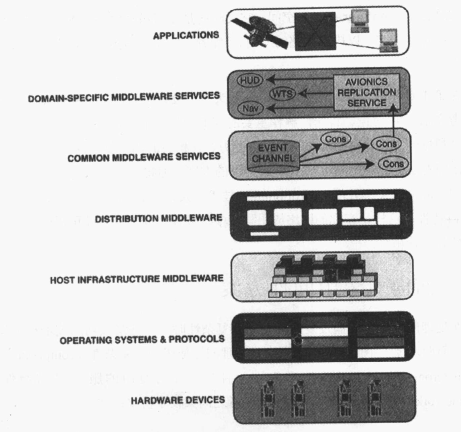

#设计课题、中间件方案、ACE
本章讲述“设计范式的转移”，即从独立应用体系向网络应用体系的转移。这种转移会引发两类新的挑战：一类归属于问题空间，面对的是“软件体系及设计”方面的问题；一类归属于方案空间，涉及的是“实现网络应用程序的软件工具和技术”。
##网络应用面临的挑战
在独立应用体系中，一台独立的计算机包含软件的所有组成部分，包括图形用户接口（GUI）、应用服务处理和持久数据资源等等。相反，在网络应用体系中，应用系统被划分为所谓的“服务”，供多个应用程序共享和复用。

交互式GUI、指令处理和持久数据资源被分割开来，分布在网络中的多个独立主机中。在运行期间，一个网络应用程序的控制流程驻留在一个或多个主机中。系统中的所有组成部分协同通信，根据需要相互之间传输数据和控制命令。只要使用兼容的通信协议，即使底层的网络、操作系统、硬件和编程语言种类不同，分离的组件之间也可以达成互操作性。这种跨越多个主机、将网络应用服务的职责进行委托的做法，可以带来以下好处：

1. **增强可连接性和协作性**。信息可以迅速传播给更多的潜在用户。
2. **提供性能和可伸缩性**。根据目前和预计的系统需求，可以快速、安全地改变系统配置，以调整计算资源。
3. **降低成本**。用户和应用程序可以共享昂贵的外围设备和软件，如复杂的数据库管理系统。

作为一名网络应用程序开发者，你的任务是：首先了解你的应用程序将要提供哪些服务，有哪个（哪些）现有环境可以提供这些服务；然后

（1）针对服务设计各种机制，供“服务和服务”之间、“服务和客户”之间通信时使用。

（2）确定有哪些体系结构和服务配置能够最有效地利用现有环境。

（3）利用技术和工具实现这些方案，从而消除复杂性，并设计出正确、可扩充、高性能、低维护量的软件，最终实现你的商业目标。

和独立应用程序相比，网络应用程序往往更难于设计、实现、调试、优化和监控。开发、配置网络程序时会涉及所谓“固有”及“偶发”复杂性，必须学会如何去应对这些复杂性。

*固有复杂性*是由所在领域存在的主要难题造成的，这些难题会导致网络应用开发复杂化，具体包括：

- 选择合适的通信机制，并设计良好的协议来有效使用这些机制；
- 设计合理的网络服务，以有效利用现有计算资源、并降低将来的维护成本；
- 有效使用并发机制，使系统获得可预计的、可靠的高性能；
- 管理和配置服务，以获得最大程度的系统可用性和灵活性。

*偶发复杂性*源自开发网络应用软件时使用的工具和技术存在的局限性，具体包括：

- 缺乏类型安全、可移植、可扩充的原始OS API；
- 算法分解的广泛使用，无谓地造成网络应用程序在维护和扩充上的困难；
- 网络应用汇总，核心概念和功能的不断发现和创造，造成软件生命周期的成本无谓地居高不下。

##网络应用的设计空间
本书讨论的设计空间是经过详尽的领域分析后确定的，它们基于过去10多年亲手开发数百个网络应用产品和系统时积累的设计和实现经验。领域分析是一个归纳和反馈驱动的过程，它对一个应用领域进行系统的分析，识别出其核心课题和设计空间，从而为它们找到相应的解决之道。这个过程带来以下好处。

- **为领域中的抽象概念定义了一个常用词汇表**。这一方面使得开发者能够更有效地交流；另一方面，一旦明确了问题空间中的词汇，在方案空间中寻找对应的模式和软件抽象体的工作就会得以简化。
- **提高了可复用性**。它将设计问题分为两类：

（1）和“应用的类型”相关的问题；

（2）这个领域中，所有应用共有的问题。

在一个领域中，如果将注意力集中在那些共有的设计问题上，应用程序和中间件开发者就能够抓住时机，改造或构造出可复用的软件类库。在这些类库中，如果规范的控制流程被提取出来，并经过重新整合，就可以构成中间件框架，从而显著降低后续的应用程序开发工作。在一个成熟的领域中，借助面向对象语言特性，如继承、动态绑定、参数化类型和异常，可以扩充、定制现有的中间件框架，从而系统地解决“和应用相关”的设计问题。

在网络应用领域中，开发者面临设计上的抉择。这些设计空间涉及的主要是固有复杂性的管理。

1. **通信空间**。它指的是网络应用进行交互的规则、形式和抽象层次。
2. **并发空间**。它指的是一些策略和机制，用来控制如何正确使用进程和线程，以表达多个服务实例，以及每个服务实例如何在内部使用多线程。
3. **服务空间**。它反映网络应用服务的主要性质，如每个服务实例的持续时间和结构。
4. **配置空间**。它反映的是如何识别网络服务，以及在何时将网络服务绑定在一起，以构成完整的应用。“配置”往往影响到多个服务，以及服务之间的关系。

##面向对象中间件方案
在处理网络应用的偶发复杂性和固有复杂性时，一些最成功的技术和工具主要集中在“面向对象”中间件中，它有助于管理网络应用中的复杂性和异种型。“面向对象”中间件提供了可复用的服务/协议组件和框架软件，在功能上为以下二者之间架设了桥梁：

（1）端对端应用的功能需求；

（2）底层的操作系统、网络协议栈和硬件设备。

###面向对象中间件层

一个常见的面向对象中间件体系结构，一般包括如下所述的几个层次：

- 主机基础设施中间件（Host infrastructure middleware）对OS“并发”机制和“进程间通信”机制进行封装，以获得“面向对象”网络编程能力。